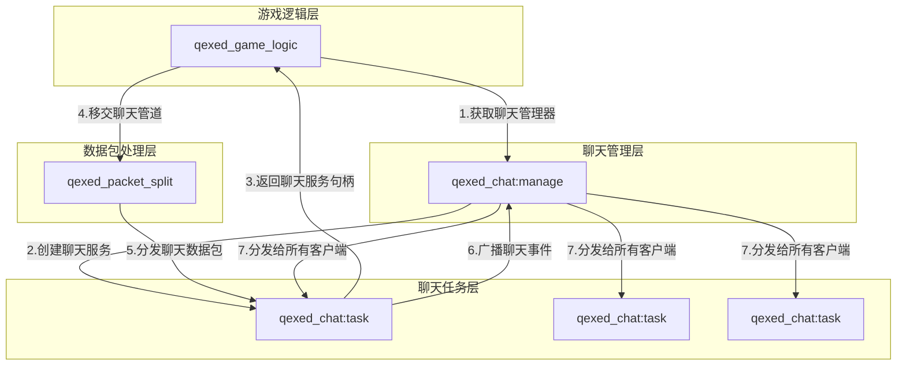

# qexed_chat 聊天
**文档信息**

* **配置版本**：0
* **最后更新**：2025年12月22日 14:45
## 功能
1. 聊天
## 游戏内截图

## 服务关系图

## 配置文件
``` toml
version = 0
```
### 参数说明
| 参数 | 类型 | 说明 |
| --- | --- | --- |
| version | i32 | 配置文件版本 | 
## 命令
暂无
## 常见问题
暂无