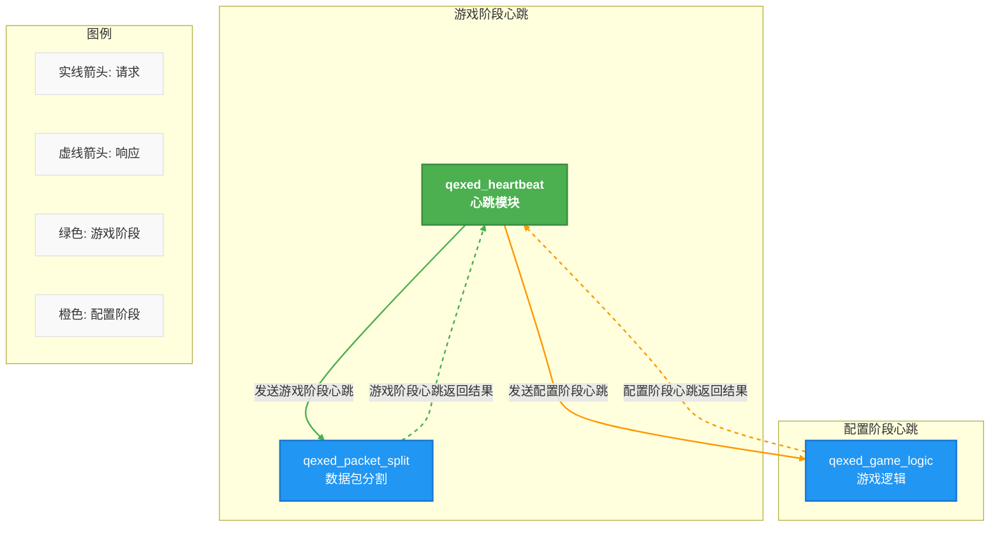

# qexed_heartbeat 心跳服务
**文档信息**

* **配置版本**：0
* **最后更新**：2025年12月22日 15:35
## 功能
1. 维护配置阶段与游戏阶段tcp连接心跳
## 服务关系图

## 配置文件
``` toml
interval_seconds = 5
timeout_seconds = 30
max_consecutive_misses = 3
enabled = true
```
### 参数说明
| 参数 | 类型 | 说明 |
| --- | --- | --- |
| interval_seconds |  i32 |  心跳间隔（秒）（超过大概30秒左右的时间客户端会断开连接！！！） | 
| timeout_seconds |  i32 | 超时时间（秒） | 
| max_consecutive_misses |  u32 | 最大连续丢失次数 | 
| enabled |  bool | 是否启用心跳 | 
## 命令
无
## 常见问题
无