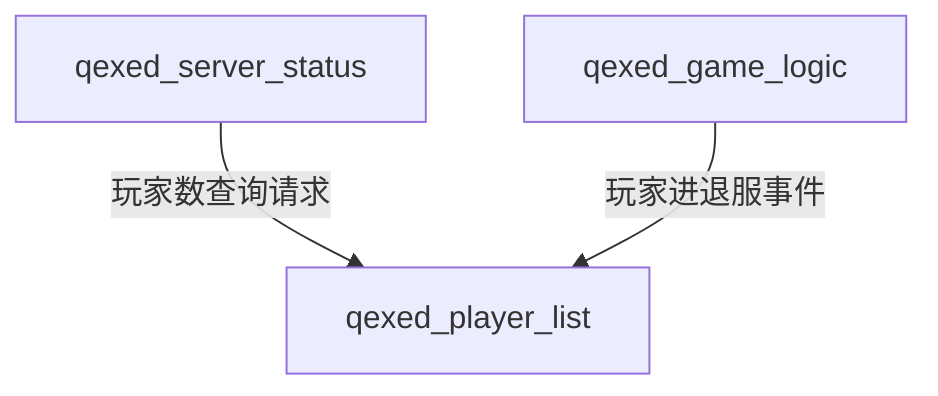

# qexed_player_list 玩家列表
**文档信息**

* **配置版本**：0
* **最后更新**：2025年12月22日 14:00
## 功能
1. 统计玩家列表
2. 统计玩家数
## 服务关系图

## 配置文件
``` toml
version = 0
max_player = 20
auto_update = false
```
### 参数说明
| 参数 | 类型 | 说明 |
| --- | --- | --- |
| version | i32 | 配置文件版本 | 
| max_player | i32 | 最大玩家数 | 
| auto_update | bool | 玩家数动态扩充，此数值根据集群运行情况自动扩缩容（该参数暂时不生效） | 

## 命令
玩家列表的命令相对简单，只有查询功能而已
### /list 玩家列表
描述: 查询玩家列表

权限组要求: `qexed.list`

另名:`list`、`玩家列表`

参数:`page`

指令说明:
玩家列表指令相对原版mc服务端来说，增加了页码信息，页码信息类似 `help`，
此外每页10个玩家，如下:
```shell
/list [页码:int]
```

游戏内执行效果:

## 常见问题
无