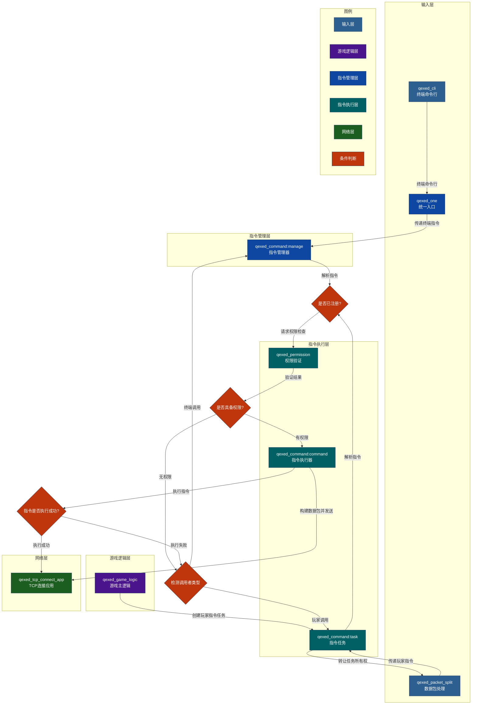

# qexed_command 指令
**文档信息**

* **配置版本**：0
* **最后更新**：2025年12月22日 15:25
## 功能
1. 注册指令
2. 校验权限
3. 执行指令
## 游戏内截图

## 服务关系图

## 配置文件
```toml
version = 0
tab = true
game_stop_cmd = false
game_var_cmd = true
```
### 参数说明
| 参数 | 类型 | 说明 |
| --- | --- | --- |
| version | i32 | 配置文件版本 | 
| tab | bool | 启用tab补全功能(如果禁用意味着你只能手动help查询帮助了)(暂未启用) | 
| game_stop_cmd | bool |启用服内stop命令(高风险命令!!!)| 
| game_var_cmd | bool | 启用服内version命令(查看服务器信息)(暂未启用) | 
## 命令
玩家列表的命令相对简单，只有查询功能而已
### /help 帮助指令
描述: 查询已注册且有权限的指令

权限组要求: `exed.help`

另名:`帮助`、`?`、`helpme`

参数:`page_or_command`

指令说明:
每页10个指令，如下:
```shell
/list [页码:int]
/list [指令:String]
```
## 常见问题
暂无