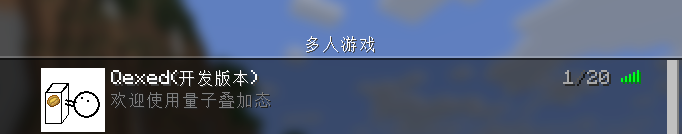
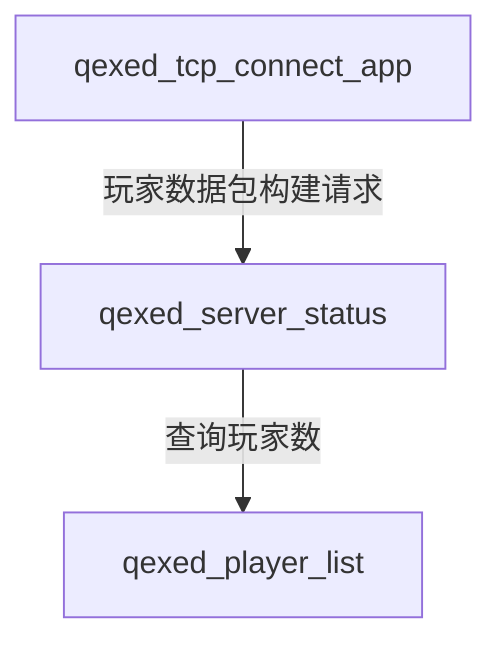

# qexed_server_status 服务器状态
**文档信息**

* **配置版本**：0
* **最后更新**：2025年12月22日 14:30
## 功能
1. 答复Status阶段的PingStart请求
2. 玩家列表缓存
## 游戏内截图

## 服务关系图

## 配置文件
``` toml
version = 0
cache = 30
motd = [
    "欢迎使用量子叠加态",
    "桶木跑路了",
]
favicon = "data:image/png;base64,iVBORw0KGgoAAAANSUhEUgAAAEAAAABACAYAAACqaXHeAAAACXBIWXMAAA9hAAAPYQGoP6dpAAACtklEQVR42u2ay0rDQBSGJ2EQCipqERU3SkFQQUERRJSCuHDrQvcu3Powbn0DH6IIohQKIi26ELRF8FLxAlbsyksTmTC2yVwyk3ZizmySkjaT/zvnP5mT1PpuDJTgYaOEDwAAAAAAAAAAAAAAAAAAAAAAAABI5MAyX7YsS3lC07pvLCs+jAAd4DpqARXxia8BpsOzk5r6QgB0iTfZOnbU0TO9bthRCIhT0cRRpX4U4v2yUnUezJokrA10iReZX7XWYN0CdNUO0Wj7BUzm+rGJvpSJKn2c/M7ZikKQArC/1RqVnYPvjon3gyELwWp+N+j3QyJ8cHYNTU30uPuvz1V3W8yd/IHAmph3UToLqOi5uAAc8dnNDU/0eeW95SSf10UPQlgAQZEPC0U0kzAv5R3xtPDFhRQaHc+4+7flK1R5SqHba30W0HUHoe2gVAOIeFo4EZ8v1Bt7dTSzuuTCCqoHKqmvAoRAYM2PWdF3PH9eeQwUvzyf8WpB6cZiimve6rrdqmYMcylMCh6d8seFO088GbkiZkaB5ftOd4yYl/601x/KvylPxBN7DPUidC+Yjn4FTtQqYazBswETgCNueHygIR41xL94wi8ua2gk/eEer771ofvTI7SX/wrl7043Tszb4O6ijda3s6746bFu1J8e8rLCEX92WHL3afG8KDdHsB0AWHNw1wEOhJG5FTQ52uV+fqk9+grnpTHP68YCIBDoEZTuMguhZiBGA5CdTHYl2I5nCEHnhldj/1mcyBrDCABBdaEd/YUdx6jpPI8xAHQWQJl+w6gMoK0QNhNkmy3jLCCyihRprCJ5JqialrINjEhEVd8VYNPEs+4MUSynjXwsLmMJ7W+GTIh+OxsmOy7iY7cUjoN4aIaiAhCX6AcWQdX1eJz+TYbjfPFQAwAAAAAAAAAAAACl8QOub9TOwLTmGwAAAABJRU5ErkJggg=="
```
### 参数说明
| 参数 | 类型 | 说明 |
| --- | --- | --- |
| version | i32 | 配置文件版本 | 
| cache | i32 | 缓存时间 | 
| motd | Vec<String> | 随机描述内容 | 
| favicon | String | 服务器logo base64|
## 命令
暂无
## 常见问题
### 为什么我服务器玩家有变化却还是显示原来的信息
服务器Ping请求有缓存，缓存结束后就就会刷新了。
缓存的时间根据你设置的`cache`决定
> cache 默认30秒

### 我如何更换我服务器的头像
你可以前往 [https://www.lddgo.net/convert/imagebasesix](https://www.lddgo.net/convert/imagebasesix) 或其他第三方网站进行生成
 

> 开发者不担保网站安全性，您可以自行浏览器搜索其他方法

上传后我们复制base64的编码的内容


> 截图中内容如下
> ```
> data:image/png;base64,iVBORw0KGgoAAAANSUhEUgAAAMEAAADDCAIAAAC06OLAAAAMlElEQVR4Ae2cMa5uxRGELxsiRSJABGyAgIQdEDhmA5a3YITEBhASEXsgIXTALtgBVt//6dPV6aehZnrOnDn/LXSDujNVXdU97Xf8bMsvLy8vf/sfT6AwgRfvUGF6lsYEvEPeg+oEvEPVCVrvHfIOVCfgHapO0HrvkHegOgHvUHWC1nuHvAPVCXiHqhO03jvkHahOwDtUnaD13iHvQHUC3qHqBK33DnkHqhPwDlUnaL13yDtQnYB3qDpB671D3oHqBLxD1Qla7x3yDlQn4B2qTtB675B3oDoB71B1gtZ7h7wD1Ql4h6oTtN475B2oTsA7VJ2g9d4h70B1At6h6gSt9w55B6oT8A5VJ2i9d8g7UJ2Ad6g6Qeu9Q96B6gS8Q9UJWu8d8g5UJ+Adqk7Qeu+Qd6A6Ae9QdYLWe4e8A9UJeIeqE7TeO+QdqE5g0Q6FzZb/VOdn/bL/n/wt9ydCeQfqE1g0R+9Q/am2rXDuDuXVuWQQOQYnl+R5MlPv0JM96AXteIcuGPqTWZ6yQ3wpANdOjRgZXBvsOdxjqtM72e2pch5Opvf+Dgt6h97ho09u+Zl3iD9sAAwvn3Bl0DsB71DvxMw/TsA7dJyIf++dwMwd4gMB6E0zhY97BtTnihOD4QnEMIfFByEPAzgQ1vyKewYE4IoTg+EJxDCHxQchDwM4ENb8insGBOCKE4PhCcQwh8UPIe8BKBYck+OeQS4IJ1/5pHcCMcxezYHPewAOhDW/4p5BDgAnX/mkdwIxzF7Ngc97AA6ENb/inkEOACdf+aR3AjHMXs2DzzNkMFawqOqKAbloavnflf8dI8+QwSWT7YoB+ZKoT2YawxxriWfIYKxgUdUVA3LR1PLJfw5dMlC2AaDE6CIrBd8zJ4Y51j/PABirU1ThDlAKdpGVgu+ZE8Mc659nAIzVKapwBygFu8hKwffMiWF29c/0AV3yWWTcAV2Vx1RdFl1k8iigq/ICcmTusslNdslnkYsxkM/KU6xDHgUUvabLI3NX0dxkl3wWuRgD+aw8xTrkUUDRa7o8MitFld4u4SjhM4eo+Wr6CV4LwPTwSsHoS+UtmEG/hRI+c/DJV9NP8FoApodXCkZfKm/BDPotlPCZg0++mn6C1wIwPbxSMPpSea8zUMgLOLzHmFdRrphioQClIBylIBxU54HwUqqvzLQgz4J2sFCA0jIcpSAcVOeB8FKqr8y0IM+CdrBQgNIyHKUgHFTngfBSqq/MtCDPee1QOQOlryInm3JSrNyQh0XjmqsFUfBSQDFPUd5ISOUMGqpZV9mUk1kWuU5Y5NN8siBKNm2cFPMU5UowLAAN1awrvDKYZZHrhFc+zSdkylfKyY/fvOg/SsFinqI8J6RgBpm84CTH4GS6e1RWihYT6Av04zcr8hTbyROjYAaZvOAkx+BkuntUVooWE3iHlCFP5PBeGUx0eZQ6ZYfyxvz6768eP3/+/PXh5/f/fn74Qd7oltE0OI2ropzK1AFwtRsgIWBWwiio1OoyZgkA3iFlyKdyeEHALDvvUGmSvAegVO5MMQkBs9yioFJLMeZPncPX6s+fv+Zr9dP3n+o/FMwJlTxZxcksOXUAWGQAB5A5551gmkHRNAoqJTBukHly79BHp8QMAR+lnXSIaQZFxyiolMC4QfYOtYfJDAGNYU6/wjSDolcUVEpgnMl5dRpfrv/98tnj568/vj38cPXbD18+fqicTRt5MjmfzJJ31YEMyMEWnOAOKJpGHaVEw4+X5hPmHfroSJkh4KO0sw9xBxQdo45SouHnHeqdYWOYylsUObgDJhRUSjT82KH8xw+fp8Nn6+2vcPLf1yiIBVEbeeAAMjmfQG4AVIAGef8rugCMZQ65omzY8MA8OdvAfrxdmgOGgwpAQSyI2sgDB5DJ+QRyA6ACNMj7X9EFYCxzyBVlw4YH5slZAvbjsDdvf4WDCkBBLIjayAMHkMn5BHIDoAI0yPtf0QVgLHPIFWW24V357zF4e9bi7a4cMBxU+d+Ss0P/+uyTxw9Rcx6uAHDGAHUAuQ5X54HzTGdVjjpK//hB9g6Jo2NiY4DJA8bqZBUFAZmjnIRc5b1aQfYOiaNjYmOABwaM1ckqCgIyRzkJucp7tYLMDvEN4qt0+Gz99ce3fLn4zw8hIwfwCfvPd188fsa+ZUQFMKxZgMrngRx1ltesylFHyYQfZO+QODomNgaYPGCsTlZREJA5yknIVd6rFWTvkDg6JjYGeGDAWJ2soiAgc5STkKu8VyvI7BCfHj5PjS8XHL5cgFwH8qxvGeGVqcFRAJXvCHKDXV2EXBFgA9k7xEzEGTK63cDbRh64K2FIFAE2kL1DzEScIaPbDbxt5IG7EoZEEWADmR3ii8PfuQBc8cEC8J9M5k9Y469juOc8XAHgAPIVJw2AHNAg3/GKvgBdXYRKEeTq3iFlbrfg8LiArtjeoX8eF5MF/LPmVgz6AnTFD5UiaFTnL035E8Z3ik8YJwC+d9QBNII18qCC0wWQA7Kcq+cAxQZDrgwCm0zmyb1DeTi3OOFxAV2xvUPM7QPI4zsytH/V5TrbnhQbDLnSGzYNMn8g8Rcr/vIFGPtyZVMlT0OFfAzkyrc+yUPoaifkigCbBtk71BjOzlc8LqArrXeIuXWArhHvT86dd2WeuUMY8wdSA0AeA7Q9XU7lBhgz3VaVO+2KGnJFgI1CbqwOV0qdBqcrT67TkHPVALngrU9yp13thFwRYKOQWZQGUOo0OF15cp2GnKsGyAVvfZI77Won5IoAG4W8gFPMMyZHBVjQ6XkWdAEY8wq5oizaKBZdnGKeMTkqQFfm3ch0ARhLGHJFWbRRLLo4xTxjclSArsy7kekCMJYw5IqyaKNYdHGKecbkqABdmXcj0wVgLGHIFWXRRrHo4hTzjMlRAboy70amC8BYwpAryqKNYtHFKeYZk6MCdGXejUwXgLGEIVeURRvFootTzDMmRwXoyrwJmfAZjCWMOooSP4W8gFPMMyZHBVjQ6XQLwmcw5hV1FCV+CnkBp5hnTI4KsKDT6RaEz2DMK+ooSvwU8gJOMc8sebHOgkFlCzIDMqfrJOoogll+ipfCKeaZJS/WUTqdziEzoGgRdZQSs/wUL4VTzDNLXqyjdDqdQ2ZA0SLqKCVm+SleCqeYZ5acOgAl/CUcEmZQzBMFlRIYK+QFnGKeWXLqABb0PmZBwgzGCqKKgvzSABg3OCuvinlmyakDWDmELi8SZtBVJ5OjYD7NJxjnq0tOinmKclqmDoCrTQDBMpiVMCortUigkBdwinmKchqkDoCrTQDBMpiVMCortUigkBdwinmKchqkDoCrTQDBMpiVMCortUigkBdwinmK8twgBTPI5AUnOQYn092jslL0vASKe+YU8xTljTxUBmTyghPcM5juHhZKUaIo5AWcYp6iPDdIwQwyecFJjsHJdPeorBQ9L4HinjnFPEV5zsMJlTOAMx1kr3wy3ZSC4cUvDUCmBmflVTFPUd7olMoZNFTFq+yVT4oWDXl4Na65IhMn14JinqK80TuVM2ioilfZK58ULRry8Gpcc0UmTq4FY3nGVGOd4qWALgulIJyuymPk8FKUKzOdl2dlF3gpQGkZjlIQDqrzQHgp1VdmOi/Pyi7wUoDSMhylIBxU54HwUqqvzDQ9zybhiXEeUEY3nRPtKEVpWyEv4HTl6SKfF54Y54HzwjcqRzuNa65om5NrQVeeLvJ5fRHjPHBe+EblaKdxzRVtc3It6MrTRb6kLxIq4JKEDdPI3Ljmit44uRZ05ekiX9IXCRVwScKGaWRuXHNFb5xcC7rydJEv6YuECrgkYcM0MjeuuaI3Tq4FSh6Fc20Xz+HuHXqOd7yyC+/QldN/Du8n3CF/whavpndo8cCf0M479ISPuril59khf8IWrw523iFGYTA4Ae/Q4OAsYwLeIUZhMDgB79Dg4CxjAt4hRmEwOIHb71A08PrP4AAsK08gxq8U+fBQGlkpWOSQB1AsaPnwBLxDw6Oz8MMEuneIf91vAvySl0/AO3T5E9w+gHfo9k94eQPqDl0e1AG2nYB3aNunuU0w79BtnmrboN6hbZ/mNsG8Q7d5qm2Deoe2fZrbBPMO3eaptg3qHdr2aW4TzDt0m6faNqh3aNunuU0w79BtnmrboN6hbZ/mNsG8Q7d5qm2Deoe2fZrbBPMO3eaptg3qHdr2aW4TzDt0m6faNqh3aNunuU0w79BtnmrboN6hbZ/mNsG8Q7d5qm2Deoe2fZrbBPMO3eaptg3qHdr2aW4TLHbI/3gCnoAn4Al4Ap6AJ+AJeAKewPgE/g9i585wLJS5iAAAAABJRU5ErkJggg==
> ```

随后打开配置文件替换数据(favicon 字段)即可


