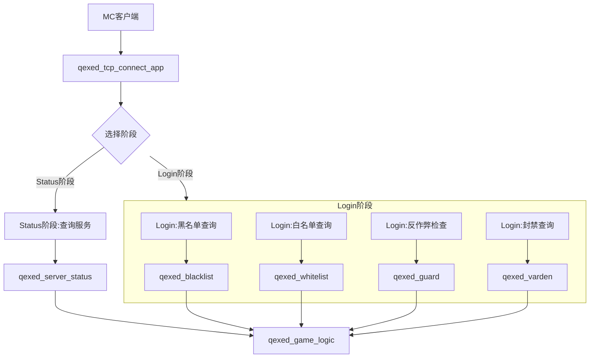

# qexed_tcp_connect - TCP连接入口模块文档
**文档信息**

* **配置版本**：0
* **最后更新**：2025年12月15日 11:00
# 功能
1. 玩家进服的唯一权威入口
2. 处理握手阶段、配置节点、登录阶段的网络数据包
3. 转发配置阶段、游戏阶段的网络数据包
4. 实现登录认证
# 服务关系图

# 配置文件
请阅读[配置](./config/main.md)

> **运维提示**：修改监听地址(`ip`)重启此服务时,玩家会掉线。
# 命令
请阅读[命令](./command/main.md)
# 常见问题
无